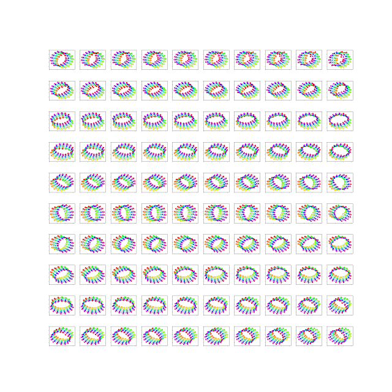

# Pytorch Implementing of A Deep Generative Model for Graph Layout

https://arxiv.org/pdf/1904.12225.pdf

This is not an official implementation  contact the authors for more info.

Check config.py scripts to change variables in trainer.

Check https://github.com/rflamary/POT to use Gromov-Wasserstein part of the paper. Disclaimer: I haven't implemented it here

# Example
<p float="left">
    
</p>

# Dataset
Dataset is generated using code  tsnet paper


# Dependencies

Look at env.txt file to setup the environment

```
conda create -n dgl python=3.6
conda activate dgl

conda install pytorch=1.0.1 torchvision cudatoolkit=10.0 -c pytorch -y
conda install -c floriangeigl -c vgauthier -c msarahan -c bioconda -c ostrokach -c salford_systems -c ptorrestr -c pkgw -c kalefranz graph-tool
conda install -c conda-forge libiconv
conda install -c conda-forge gdk-pixbuf
```
install [Pytorch-Geometric](https://github.com/rusty1s/pytorch_geometric)

# Citation

    @article{dgl,
          Author = {Pradyumna Reddy},
          Title = {DGL Pytorch},
          Journal = {https://github.com/preddy5/A-Deep-Generative-Model-for-Graph-Layout},
          Year = {2019}
    }
